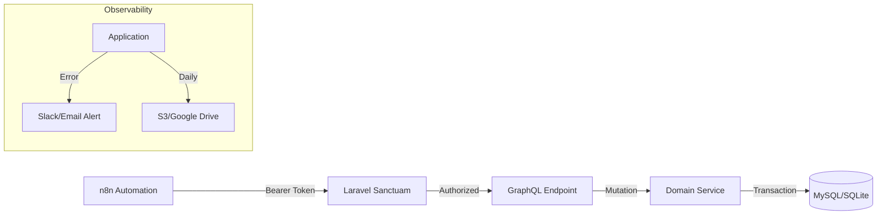

# Laravel GraphQL Service Concept (Production Ready)

**Status:** Mature Draft
**Focus:** Solo Developer, n8n Automation, Reliability
**Scale:** ~1000 tx/day (Low traffic, high reliability required)

## 1) Core Philosophy: "Robust Efficiency"
Since this is a solo-maintainer project used exclusively by automation (n8n):
-   **Stability > Scalability**: We don't need complex optimizing for millions of users. We need to know **immediately** if n8n fails.
-   **Coarse-Grained Operations**: Reduce network chatter. One Mutation should do a complete unit of work (e.g., "Create Campaign + Tags + Config" in one go) to keep n8n workflows simple.
-   **Zero Maintenance**: Automated backups, automated error reporting, automated dependency updates.

## 2) Technology Stack
| Component | Choice | Rationale |
| :--- | :--- | :--- |
| **Framework** | **Laravel 11+** | The standard for robust PHP apps. |
| **GraphQL** | **nuwave/lighthouse** | Best-in-class integration for Laravel. |
| **Database** | **MySQL 8** (or SQLite) | Strict typing, robust. SQLite is actually sufficient for 1k tx/day if simple file backup is preferred. |
| **Auth** | **Laravel Sanctum** | Simple long-lived tokens for n8n. No need for complex OAuth flows. |
| **Queue** | **Database Driver** | Keep it simple. No Redis needed unless load spikes. |
| **Observability**| **Sentry / Slack Webhook**| Instant alerts on 500 errors. |

## 3) High-Level Architecture


## 4) Structural Design Patterns
### 4.1 The Service Layer (Crucial)
Do **not** put business logic in GraphQL Resolvers.
-   **Bad**: Resolver validates data -> creates User -> sends email.
-   **Good**: Resolver calls `UserService::register(...)`.
-   *Why?* If you ever need to trigger this from a CLI command or a REST endpoint later, the logic is reusable.

### 4.2 "n8n-Optimized" Schema
Design mutations to be **Atomic** and **Idempotent**.
-   **Avoid**: `createCampaign` -> `addTag` -> `activateCampaign` (3 round trips, risk of partial failure).
-   **Prefer**: `publishCampaign(input: { ...campaignData, tags: [...] })`.
    -   This allows the n8n logic to be a single "HTTP Request" node.
    -   Wrap the entire operation in a `DB::transaction()` within Laravel.

### 4.3 Data Transfer Objects (DTOs)
Use simple DTOs (using `spatie/laravel-data` or just PHP 8.2 readonly classes) to pass data from Resolver to Service. This ensures strict typing throughout.

## 5) Security Specification
### 5.1 Authentication (Machine-to-Machine)
-   Create a specific User for n8n: `n8n_bot`.
-   Generate a long-lived Sanctum token: `php artisan sanctum:token n8n_bot --abilities="server:admin"`.
-   Rotate this token quarterly.

### 5.2 Authorization
-   Even if solo, use **Policies**.
-   Example `CampaignPolicy`:
    ```php
    public function update(User $user, Campaign $c) {
        // Even if only one user, this prevents accidents if you add a 'Viewer' role later
        return $user->tokenCan('campaign:write'); 
    }
    ```

### 5.3 Input Safety
-   **Strict Validation**: Lighthouse `@rules`.
-   **Rate Limiting**: `60/min` is plenty for n8n. Protects against n8n infinite loops accidentally DDOS-ing your server.

## 6) "Production Ready" Checklist (The Mature Parts)

### 6.1 Observability & Logging
-   [ ] **Global Exception Handler**: Catch all exceptions. If status >= 500, send a Slack notification or Email to yourself.
-   [ ] **Request Logging**: Log every mutation name and input (scrubbing secrets) to a daily log file. Helpful when "It worked yesterday but failed today".

### 6.2 Maintenance & Backups
-   [ ] **spatie/laravel-backup**: Run nightly.
-   [ ] **Destination**: Google Drive or S3 (free tier).
-   [ ] **Pruning**: Keep 7 days of backups.

### 6.3 Testing Strategy (Contract Testing)
Since user is n8n, "frontend" breaking is less visual but more catastrophic for logic.
-   **Feature Tests**: Create a test suite that mimics the *exact* n8n payloads.
    ```php
    public function test_n8n_create_campaign_payload() {
        // Copy-paste the JSON body from n8n debug console
        $payload = [...]; 
        $this->postJson('/graphql', $payload)->assertOk();
    }
    ```
-   **CI**: GitHub Actions to run these tests on every push.

## 7) Development Workflow (Solo Optimized)
1.  **Local Dev**: SQLite + Local Valet/Herd.
2.  **Dev-to-Prod**: Git Push.
3.  **Deployment**: GitHub Action ssh-ing into server -> `git pull` -> `migrate` -> `cache:clear`. (Simple "deploy script" strategy).
    -   *No need for Docker/K8s complexity for 1k req/day.*

## 8) Sample Schema (n8n Optimized)
```graphql
type Campaign {
    id: ID!
    title: String!
    status: CampaignStatus!
    metadata: String # Store JSON strictly if schema varies wildly
}

enum CampaignStatus { DRAFT ACTIVE ARCHIVED }

input MaintainCampaignInput {
    title: String! @rules(apply: ["required", "min:5"])
    status: CampaignStatus
    # JSON string for flexible data, easier for n8n to construct than complex nested input objects
    metadata_json: String 
}

type Mutation {
    # "Upsert" style - if ID provided, update. If not, create.
    # Returns the Campaign directly to give n8n the ID immediately.
    maintainCampaign(id: ID, input: MaintainCampaignInput!): Campaign! 
        @field(resolver: "App\\GraphQL\\Mutations\\MaintainCampaign")
}
```
