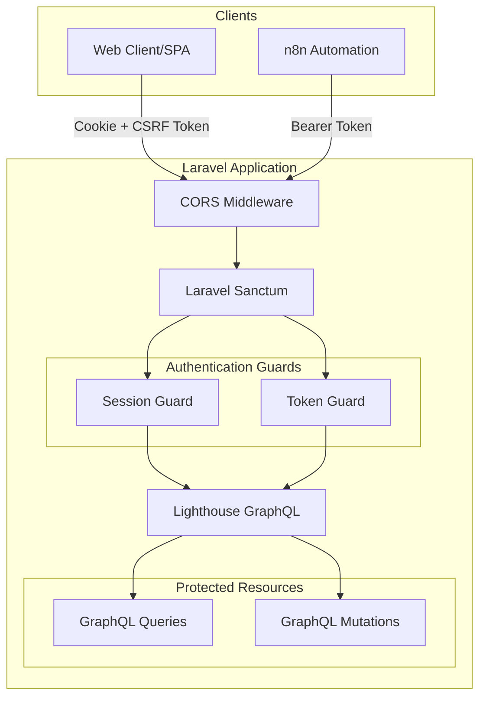
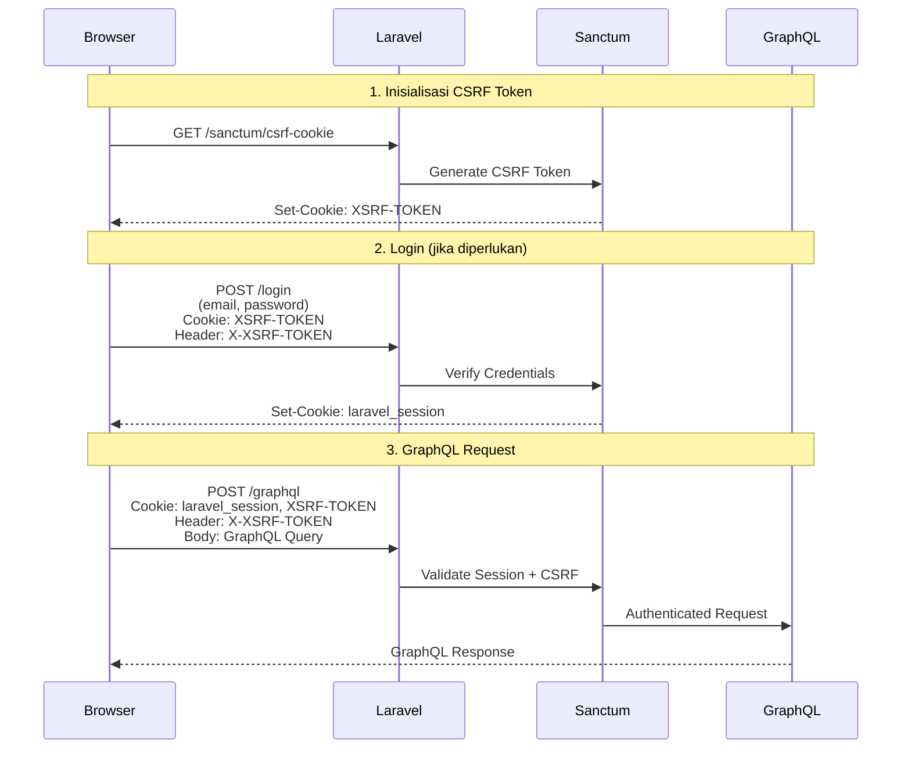
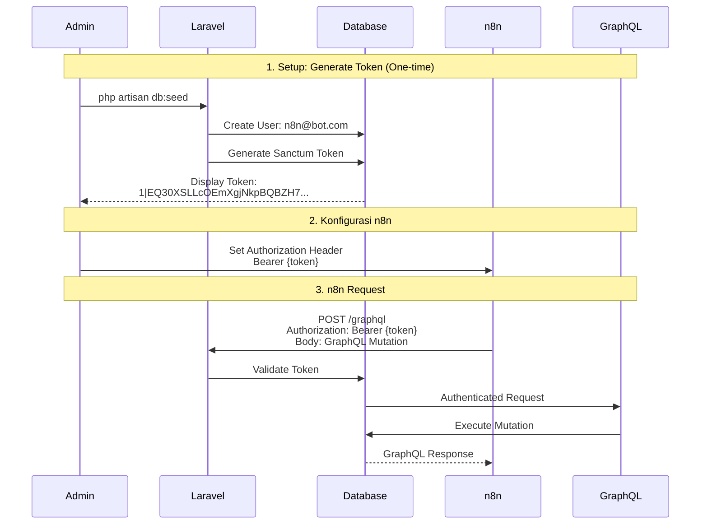

# Dokumentasi Flow Credential & Security

**Proyek:** Laravel GraphQL Service  
**Tujuan:** Dokumentasi alur keamanan dan kredensial untuk Web Client dan n8n Automation

---

## 📋 Daftar Isi

1. [Gambaran Umum Arsitektur Keamanan](#gambaran-umum-arsitektur-keamanan)
2. [Komponen Keamanan](#komponen-keamanan)
3. [Flow Autentikasi Web Client](#flow-autentikasi-web-client)
4. [Flow Autentikasi n8n](#flow-autentikasi-n8n)
5. [Konfigurasi Keamanan](#konfigurasi-keamanan)
6. [Best Practices](#best-practices)

---

## 🏗️ Gambaran Umum Arsitektur Keamanan

Proyek ini menggunakan **Laravel Sanctum** sebagai sistem autentikasi utama yang mendukung dua mode akses:

1. **Web Client (SPA)** - Menggunakan session-based authentication dengan CSRF protection
2. **n8n Automation** - Menggunakan token-based authentication (Bearer Token)



---

## 🔐 Komponen Keamanan

### 1. Laravel Sanctum

**Lokasi Konfigurasi:** [`config/sanctum.php`](file:///Users/macbook/Documents/PERSONAL/GRAPHQL-SRV/config/sanctum.php)

**Fungsi Utama:**
- Menyediakan autentikasi berbasis token untuk API
- Mendukung session-based authentication untuk SPA
- Mengelola token expiration dan abilities

**Konfigurasi Penting:**

```php
// Stateful domains - domain yang dapat menggunakan session
'stateful' => explode(',', env('SANCTUM_STATEFUL_DOMAINS', 
    'localhost,localhost:3000,127.0.0.1,127.0.0.1:8000,::1'
)),

// Guard yang digunakan
'guard' => ['web'],

// Token expiration (null = tidak pernah expired)
'expiration' => null,
```

**Environment Variables:**
```env
SANCTUM_STATEFUL_DOMAINS=localhost:3000
```

### 2. CORS (Cross-Origin Resource Sharing)

**Lokasi Konfigurasi:** [`config/cors.php`](file:///Users/macbook/Documents/PERSONAL/GRAPHQL-SRV/config/cors.php)

**Fungsi:**
- Mengizinkan request dari domain tertentu
- Melindungi API dari unauthorized cross-origin requests

**Konfigurasi:**

```php
'paths' => ['api/*', 'sanctum/csrf-cookie', 'graphql'],

'allowed_origins' => explode(',', env('CORS_ALLOWED_ORIGINS', 
    'http://localhost:3000'
)),

'supports_credentials' => true, // Penting untuk cookie-based auth
```

**Environment Variables:**
```env
CORS_ALLOWED_ORIGINS="http://localhost:3000"
```

### 3. Lighthouse GraphQL

**Lokasi Konfigurasi:** [`config/lighthouse.php`](file:///Users/macbook/Documents/PERSONAL/GRAPHQL-SRV/config/lighthouse.php)

**Middleware yang Digunakan:**

```php
'middleware' => [
    // Memastikan response dalam format JSON
    \Nuwave\Lighthouse\Http\Middleware\AcceptJson::class,
    
    // Mencoba autentikasi request
    \Nuwave\Lighthouse\Http\Middleware\AttemptAuthentication::class,
],
```

**Schema Protection:**

Di [`graphql/schema.graphql`](file:///Users/macbook/Documents/PERSONAL/GRAPHQL-SRV/graphql/schema.graphql), semua query dan mutation dilindungi dengan directive `@guard`:

```graphql
type Query {
    users: [User!]! @all @guard
    user(id: ID @eq): User @find @guard
    
    campaigns(status: CampaignStatus @eq): [Campaign!]! 
        @paginate(defaultCount: 10) @guard
    campaign(id: ID @eq): Campaign @find @guard
}
```

---

## 🌐 Flow Autentikasi Web Client

### Skenario: Single Page Application (SPA)

Web client menggunakan **session-based authentication** dengan CSRF protection.



### Langkah-langkah Detail:

#### 1. **Inisialisasi CSRF Token**

Sebelum melakukan request apapun, web client harus mendapatkan CSRF token:

```javascript
// Fetch CSRF cookie
await fetch('http://localhost:8000/sanctum/csrf-cookie', {
    credentials: 'include' // Penting untuk mengirim/menerima cookies
});
```

**Response:**
- Cookie `XSRF-TOKEN` akan di-set oleh server
- Cookie ini harus disertakan dalam setiap request berikutnya

#### 2. **Login (Opsional)**

Jika aplikasi memerlukan login tradisional:

```javascript
await fetch('http://localhost:8000/login', {
    method: 'POST',
    headers: {
        'Content-Type': 'application/json',
        'X-XSRF-TOKEN': getCookie('XSRF-TOKEN') // Ambil dari cookie
    },
    credentials: 'include',
    body: JSON.stringify({
        email: 'user@example.com',
        password: 'password'
    })
});
```

**Response:**
- Cookie `laravel_session` akan di-set
- Session ini akan digunakan untuk autentikasi request berikutnya

#### 3. **GraphQL Request**

Setelah terautentikasi, kirim GraphQL query:

```javascript
const response = await fetch('http://localhost:8000/graphql', {
    method: 'POST',
    headers: {
        'Content-Type': 'application/json',
        'X-XSRF-TOKEN': getCookie('XSRF-TOKEN'),
        'Accept': 'application/json'
    },
    credentials: 'include', // Kirim cookies
    body: JSON.stringify({
        query: `
            query {
                campaigns {
                    id
                    title
                    status
                }
            }
        `
    })
});
```

### Konfigurasi yang Diperlukan:

**Di `.env`:**
```env
# Domain web client
SANCTUM_STATEFUL_DOMAINS=localhost:3000
CORS_ALLOWED_ORIGINS="http://localhost:3000"
```

**Di Web Client:**
- Pastikan `credentials: 'include'` di semua fetch request
- Kirim header `X-XSRF-TOKEN` dengan nilai dari cookie `XSRF-TOKEN`
- Jangan hardcode token, gunakan cookie yang di-set oleh server

---

## 🤖 Flow Autentikasi n8n

### Skenario: Machine-to-Machine (M2M) Authentication

n8n menggunakan **token-based authentication** dengan Bearer Token yang long-lived.



### Langkah-langkah Detail:

#### 1. **Generate Token (Setup Awal)**

Token dibuat melalui database seeder:

**Lokasi:** [`database/seeders/DatabaseSeeder.php`](file:///Users/macbook/Documents/PERSONAL/GRAPHQL-SRV/database/seeders/DatabaseSeeder.php)

```php
$user = \App\Models\User::firstOrCreate(
    ['email' => 'n8n@bot.com'],
    ['name' => 'n8n Bot', 'password' => bcrypt('password')]
);

echo "n8n Token: " . $user->createToken('n8n-setup')->plainTextToken . "\n";
```

**Jalankan seeder:**
```bash
php artisan db:seed
```

**Output:**
```
n8n Token: 1|EQ30XSLLcOEmXgjNkpBQBZH7VOcGSjWpsHAsvJ4Iff2100af
```

> ⚠️ **PENTING:** Token ini hanya ditampilkan sekali. Simpan dengan aman!

#### 2. **Konfigurasi n8n Workflow**

Di n8n, gunakan **HTTP Request Node** dengan konfigurasi:

**URL:**
```
http://localhost:8000/graphql
```

**Method:**
```
POST
```

**Authentication:**
```
Header Auth
```

**Header:**
```
Authorization: Bearer 1|EQ30XSLLcOEmXgjNkpBQBZH7VOcGSjWpsHAsvJ4Iff2100af
Content-Type: application/json
```

**Body (JSON):**
```json
{
  "query": "mutation { maintainCampaign(input: { title: \"Black Friday Sale\", status: DRAFT, metadata_json: \"{\\\"discount\\\": \\\"50%\\\"}\" }) { id title status } }"
}
```

#### 3. **Contoh Request dari n8n**

**Menggunakan curl (untuk testing):**

```bash
curl -X POST http://localhost:8000/graphql \
  -H "Authorization: Bearer 1|EQ30XSLLcOEmXgjNkpBQBZH7VOcGSjWpsHAsvJ4Iff2100af" \
  -H "Content-Type: application/json" \
  -d '{
    "query": "{ campaigns { id title status } }"
  }'
```

**Response:**
```json
{
  "data": {
    "campaigns": [
      {
        "id": "1",
        "title": "Black Friday Sale",
        "status": "DRAFT"
      }
    ]
  }
}
```

### Token Management:

#### Generate Token Manual (Alternative):

Jika perlu generate token baru tanpa seeder:

```bash
php artisan tinker
```

```php
$user = \App\Models\User::where('email', 'n8n@bot.com')->first();
$token = $user->createToken('n8n-production', ['*'])->plainTextToken;
echo $token;
```

#### Revoke Token:

```php
// Revoke semua token user
$user->tokens()->delete();

// Revoke token tertentu
$user->tokens()->where('name', 'n8n-setup')->delete();
```

#### Token Rotation (Best Practice):

Rotasi token setiap 3-6 bulan:

```php
// 1. Generate token baru
$newToken = $user->createToken('n8n-2024-Q1')->plainTextToken;

// 2. Update n8n configuration dengan token baru

// 3. Hapus token lama
$user->tokens()->where('name', 'n8n-setup')->delete();
```

---

## ⚙️ Konfigurasi Keamanan

### Environment Variables

**File:** [`.env`](file:///Users/macbook/Documents/PERSONAL/GRAPHQL-SRV/.env)

```env
# Application
APP_ENV=local
APP_DEBUG=true
APP_URL=http://localhost

# Sanctum - Domain yang dapat menggunakan session
SANCTUM_STATEFUL_DOMAINS=localhost:3000

# CORS - Domain yang diizinkan akses
CORS_ALLOWED_ORIGINS="http://localhost:3000"

# Database
DB_CONNECTION=mysql
DB_HOST=153.92.15.1
DB_PORT=3306
DB_DATABASE=u848041896_persona_db
DB_USERNAME=u848041896_personauser
DB_PASSWORD=l8P^1rkSak

# Session
SESSION_DRIVER=database
SESSION_LIFETIME=120
```

### Guards Configuration

**File:** [`config/auth.php`](file:///Users/macbook/Documents/PERSONAL/GRAPHQL-SRV/config/auth.php)

```php
'guards' => [
    'web' => [
        'driver' => 'session',
        'provider' => 'users',
    ],

    'sanctum' => [
        'driver' => 'sanctum',
        'provider' => 'users',
    ],
],
```

### GraphQL Schema Protection

**File:** [`graphql/schema.graphql`](file:///Users/macbook/Documents/PERSONAL/GRAPHQL-SRV/graphql/schema.graphql)

Semua endpoint dilindungi dengan `@guard` directive:

```graphql
type Query {
    # Hanya user terautentikasi yang bisa akses
    users: [User!]! @all @guard
    user(id: ID @eq): User @find @guard
    
    campaigns(status: CampaignStatus @eq): [Campaign!]! 
        @paginate(defaultCount: 10) @guard
}

type Mutation {
    # Mutation juga otomatis terproteksi karena resolver
    # akan di-execute setelah authentication middleware
    maintainCampaign(id: ID, input: MaintainCampaignInput!): Campaign! 
        @field(resolver: "App\\GraphQL\\Mutations\\MaintainCampaign")
}
```

---

## 🛡️ Best Practices

### 1. Token Security untuk n8n

> [!IMPORTANT]
> Token adalah kredensial yang sangat sensitif. Perlakukan seperti password!

**DO:**
- ✅ Simpan token di environment variables n8n
- ✅ Gunakan token dengan abilities terbatas jika memungkinkan
- ✅ Rotasi token secara berkala (3-6 bulan)
- ✅ Gunakan HTTPS di production
- ✅ Monitor penggunaan token melalui logs

**DON'T:**
- ❌ Jangan commit token ke Git
- ❌ Jangan share token via email/chat
- ❌ Jangan gunakan token yang sama untuk dev dan production
- ❌ Jangan simpan token di client-side code

### 2. CSRF Protection untuk Web Client

> [!WARNING]
> Tanpa CSRF token, request dari web client akan ditolak!

**Checklist:**
- ✅ Selalu fetch `/sanctum/csrf-cookie` sebelum request pertama
- ✅ Kirim header `X-XSRF-TOKEN` di setiap request
- ✅ Gunakan `credentials: 'include'` di fetch options
- ✅ Pastikan domain web client ada di `SANCTUM_STATEFUL_DOMAINS`

### 3. CORS Configuration

> [!CAUTION]
> CORS yang terlalu permissive adalah security risk!

**Production:**
```env
# Hanya domain production
CORS_ALLOWED_ORIGINS="https://app.yourdomain.com"
SANCTUM_STATEFUL_DOMAINS=app.yourdomain.com
```

**Development:**
```env
# Multiple domains untuk testing
CORS_ALLOWED_ORIGINS="http://localhost:3000,http://localhost:3001"
SANCTUM_STATEFUL_DOMAINS=localhost:3000,localhost:3001
```

### 4. Rate Limiting

Tambahkan rate limiting untuk mencegah abuse:

**Di `config/lighthouse.php`:**
```php
'route' => [
    'middleware' => [
        'throttle:60,1', // 60 requests per minute
    ],
],
```

### 5. Token Abilities (Advanced)

Batasi akses token dengan abilities:

```php
// Generate token dengan abilities terbatas
$token = $user->createToken('n8n-readonly', ['campaign:read'])
    ->plainTextToken;

// Di Policy atau Middleware
if (!$user->tokenCan('campaign:write')) {
    abort(403, 'Insufficient permissions');
}
```

### 6. Monitoring & Logging

> [!TIP]
> Aktifkan logging untuk debugging dan security audit

**Log setiap GraphQL request:**

```php
// Di config/lighthouse.php
'middleware' => [
    \Nuwave\Lighthouse\Http\Middleware\LogGraphQLQueries::class,
],
```

**Monitor failed authentication:**

```php
// Di app/Providers/EventServiceProvider.php
Event::listen(
    \Illuminate\Auth\Events\Failed::class,
    function ($event) {
        Log::warning('Failed login attempt', [
            'email' => $event->credentials['email'] ?? 'unknown',
            'ip' => request()->ip(),
        ]);
    }
);
```

---

## 📚 Referensi

- [Laravel Sanctum Documentation](https://laravel.com/docs/11.x/sanctum)
- [Lighthouse GraphQL Documentation](https://lighthouse-php.com)
- [CORS Documentation](https://developer.mozilla.org/en-US/docs/Web/HTTP/CORS)
- [n8n HTTP Request Node](https://docs.n8n.io/integrations/builtin/core-nodes/n8n-nodes-base.httprequest/)

---

## 🔍 Troubleshooting

### Web Client: CORS Error

**Error:**
```
Access to fetch at 'http://localhost:8000/graphql' from origin 
'http://localhost:3000' has been blocked by CORS policy
```

**Solusi:**
1. Pastikan domain ada di `CORS_ALLOWED_ORIGINS`
2. Pastikan `supports_credentials: true` di `config/cors.php`
3. Clear cache: `php artisan config:clear`

### Web Client: CSRF Token Mismatch

**Error:**
```
419 | CSRF token mismatch
```

**Solusi:**
1. Fetch `/sanctum/csrf-cookie` sebelum request
2. Kirim header `X-XSRF-TOKEN` dengan nilai dari cookie
3. Pastikan domain ada di `SANCTUM_STATEFUL_DOMAINS`

### n8n: Unauthenticated

**Error:**
```json
{
  "errors": [
    {
      "message": "Unauthenticated.",
      "extensions": {
        "category": "authentication"
      }
    }
  ]
}
```

**Solusi:**
1. Pastikan token valid dan belum expired
2. Cek format header: `Authorization: Bearer {token}`
3. Pastikan user dengan token masih ada di database
4. Cek apakah token sudah di-revoke

### GraphQL: @guard Directive Not Working

**Error:**
Query bisa diakses tanpa autentikasi

**Solusi:**
1. Pastikan `@guard` directive ada di schema
2. Cek middleware di `config/lighthouse.php`
3. Pastikan `AttemptAuthentication` middleware aktif
4. Clear schema cache: `php artisan lighthouse:clear-cache`

---

**Dibuat:** 2026-02-03  
**Versi:** 1.0  
**Maintainer:** Harrison
